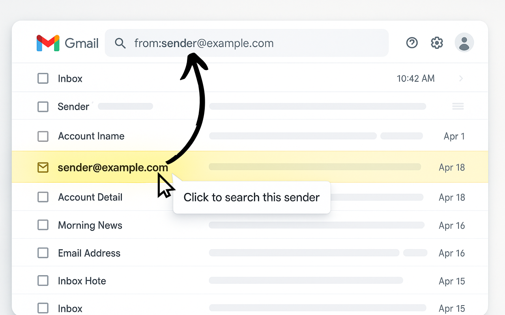

# Gmail Custom Features Extension

A Chrome Extension that injects Gmail with an extra feature, a quick sender search behavior when clicking a conversation sender.

## Features
- Automatically attaches click handlers to sender elements so clicking a name opens a `from:` search, mimicking Gmail's "Find emails from" suggestions.
- Keeps listeners intact across category tabs, history navigation, and dynamic inbox updates by observing DOM changes and history mutations.

## Getting Started (2 Methods)

### From Google Extensions 

I will upload the repo with the link when published

### From this Github

1. Clone or download this repository.
2. Open Chrome and navigate to `chrome://extensions`.
3. Enable **Developer mode** (toggle in the top right).
4. Click **Load unpacked** and select this project folder.
5. Ensure site access for the extension is enabled for `mail.google.com` (Chrome may default to "on click").

## Usage
- With the extension loaded, open any Gmail inbox.
- Click a sender name in the message list. The extension auto-fills the search box with `from:sender@example.com` and triggers the native Gmail search, displaying every message from that sender.

## Development Notes - Fairly simple if anyone wants to check
- Content injection script: `content.js`
- Manifest: `manifest.json`
- Icons: `icons/`
